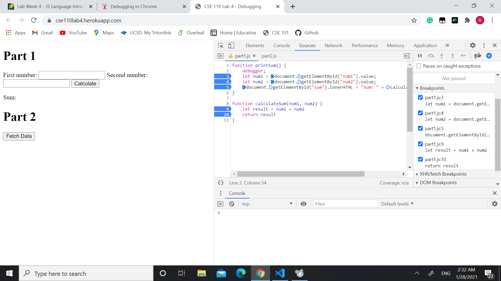
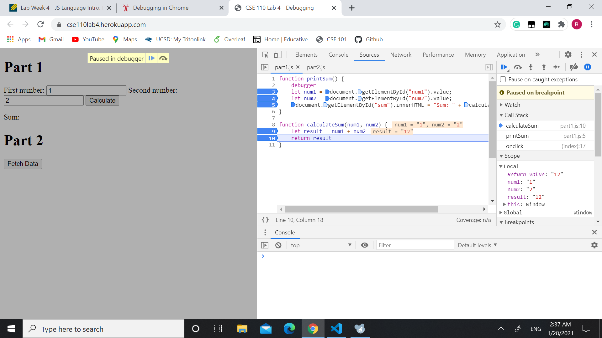
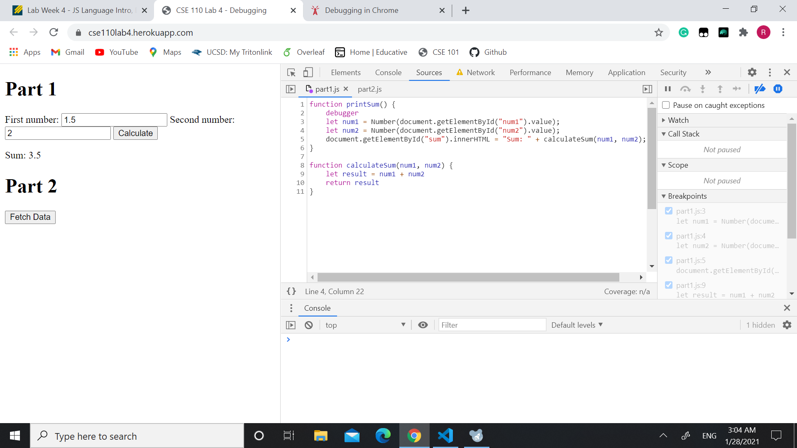

# Part 3 Debugging using the DevTools

## Debug using breakpoints

This is an image showing the breakpoints I added.  
I basiclly added breakpoints on every line that involves changing variables and calling functions.
  

The following is an image showing the values and types of num1, num2, and result.

We can clearly see that num1 is "1", num2 is "2", and result is "12", which are all strings.

The bug is that num1 and num2 are stored as strings so that num1 + num2 is also concatenated as strings.

  
To fix this bug, we just need to store num1 and num2 as numbers. So adding Numbers() around num1 and num2 should fix the bug. The fix is shown in the following image. 

## Network Tab

1. citylots.json
2. part2.js
3. 11.7MB
4. 45.06s
5. Mozilla/5.0 (Windows NT 10.0; Win64; x64) AppleWebKit/537.36 (KHTML, like Gecko) Chrome/87.0.4280.141 Safari/537.36
6. Apache
7. Tue, 26 Jan 2021 22:14:13 GMT
8. application/json
9. fetchData